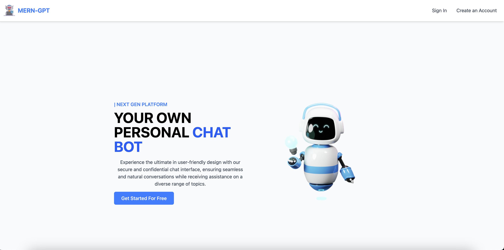
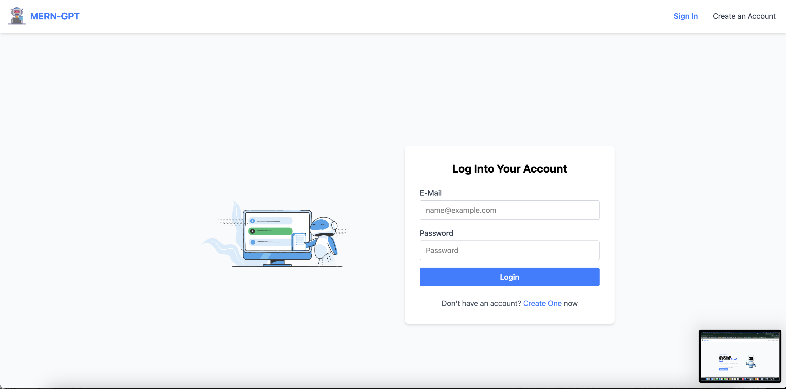
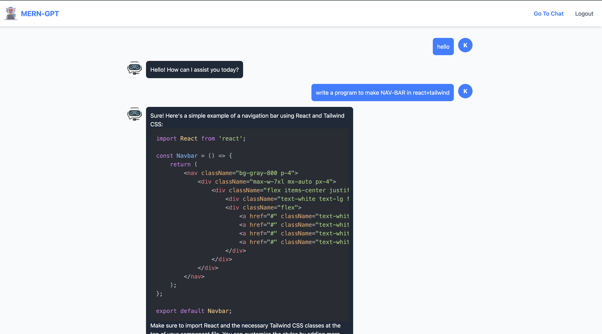

# MERN-AI Chatbot

## Overview

MERN-AI Chatbot is a full-stack AI chatbot application built using the MERN stack (MongoDB, Express, React, Node.js). This project provides a seamless chat experience with real-time capabilities and user authentication.

## Demo

[](Frontend/src/assets/demp.mp4)

## Features

- Real-time AI chat
- JWT authentication
- Persistent chat history
- Cloudinary image uploads (if applicable)
- Responsive UI

## Tech Stack

- **Frontend:** React, TailwindCSS, Axios, React Router
- **Backend:** Node.js, Express, MongoDB, JWT

## Repository Structure

```
.
├── backend/
│   ├── models/
│   ├── routes/
│   ├── controllers/
│   └── ...
├── frontend/
│   ├── src/
│   ├── public/
│   └── ...
└── README.md
```

## Installation & Setup

1. Clone the repository:
   ```bash
   git clone https://github.com/yourusername/MERN-AI-Chatbot.git
   ```
2. Install backend dependencies:
   ```bash
   cd backend
   npm install
   npm run dev
   ```
3. Install frontend dependencies:
   ```bash
   cd frontend
   npm install
   npm start
   ```
4. Create a `.env` file in both `backend/` and `frontend/` directories with the following variables:
   ```
   API_BASE_URL=your_api_base_url
   MONGODB_URI=your_mongodb_uri
   JWT_SECRET=your_jwt_secret
   ```

## Usage

1. Sign up for a new account.
   
2. Log in to your account.
   
3. Start chatting with the AI.
   

## Contributing

Contributions are welcome! Please follow these guidelines:

- Fork the repository
- Create a new branch
- Make your changes
- Submit a pull request
